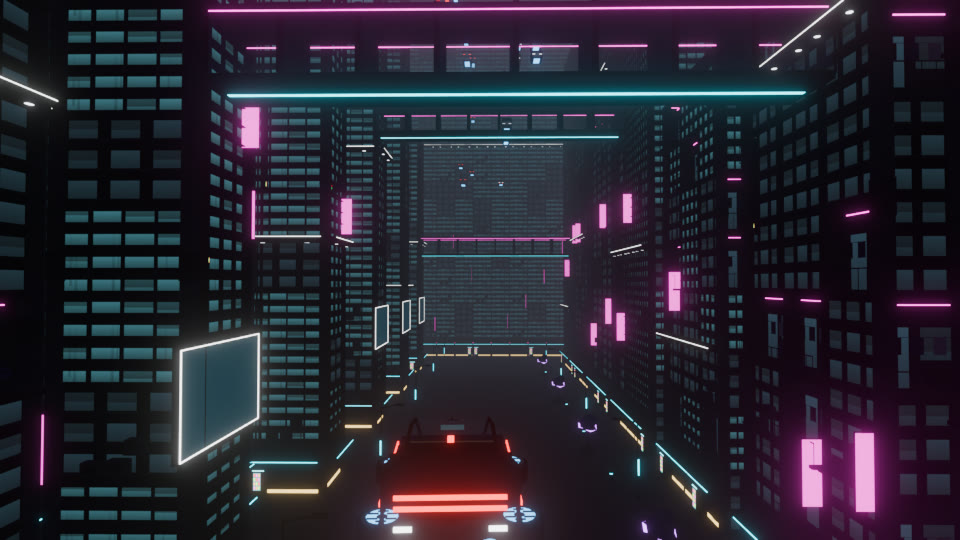
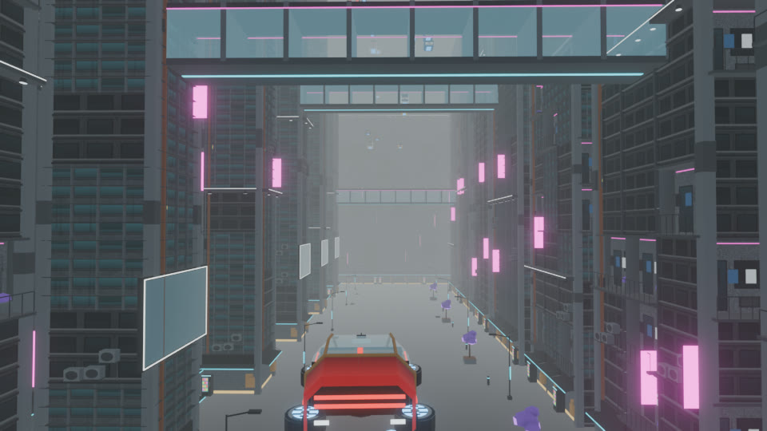
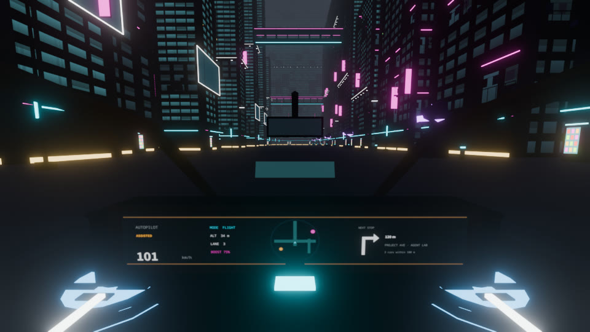
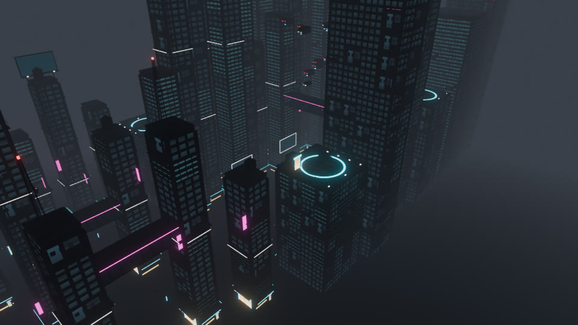
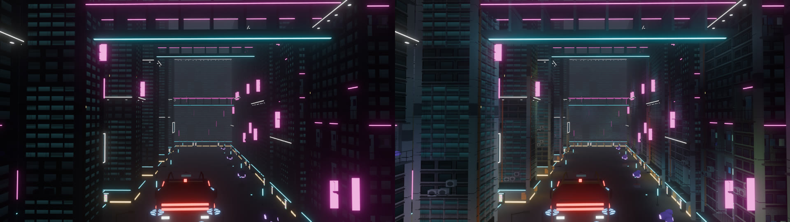
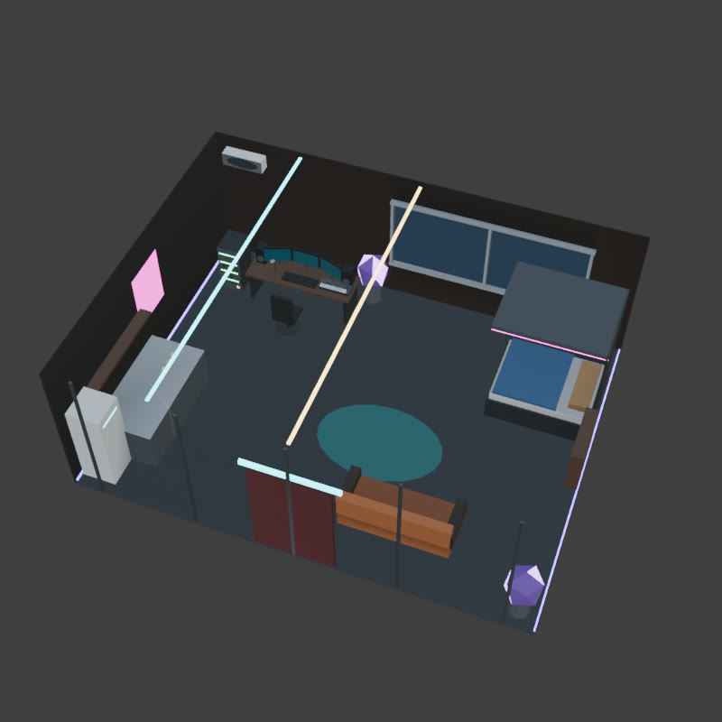

# Neon District: Asset Guide

Everything here was built on 2026-10-08 in Blender 5.2 by script, without AI generators or downloaded models. It's ready for the runtime work in [`neon-district-plan.md`](neon-district-plan.md).

- **Runtime files:** `static/models/cyber/`, about 2.7 MB in total (see `manifest.json`).
- **Editable source:** `assets/blender/neon-district.blend`. It contains the `Neon District` scene with the collections `KIT`, `CAR`, `CAR_ASSEMBLED`, `TRAFFIC`, `CHARACTERS` and `HOVERBOARD`, plus `PREVIEW`, which is the whole district as linked duplicates.
- **Rebuild:** the step scripts in `scripts/neon-district/` (section 13).
- **Check:** `npm run test:cyber-assets` (11 tests: budgets, attributes, layout, car, characters, boards, signs, light volume, apartment, mini-games, traffic).
- **Reference renders:** `docs/screenshots/neon-district/`.

| | |
|---|---|
|  |  |
|  |  |
|  |  |

The renders use Blender Eevee with mist and bloom as a **look target**. The game reproduces this with the CyberMaterial, fog and bloom described in the plan (sections 9.2–9.6).

---

## 1. Conventions (all files)

- **Units and axes:** metres, **Z up**, exported with `export_yup=False`, the same as `static/models/nyc/`. GLTFLoader output drops straight into the existing Z-up world.
- **Facing:**
  - Facade modules: wall plane at `y = 0`, outward normal **−Y**, pivot at bottom-centre.
  - Hero car: **+X forward** (as `Car.js` expects).
  - Characters and boards: **+Y forward** (as the old `createPerson`).
- **Textures are not embedded.** All GLBs reference material *names* only. Bind textures at runtime:

| File | Colour space | Use |
|---|---|---|
| `textures/kit_color.png` 1024² | sRGB | Base colour for every `nd_atlas` surface (UV0) |
| `textures/kit_mask.png` 1024² | linear | R = window glass (lit by `uLitFraction` at night), G = per-window id 0..1, B = always-emissive (neon, lamps, screens) |
| `textures/signs_color.png` 1024² | sRGB | 29 neon sign designs (see `signs-atlas.json`) |
| `textures/signs_halo.png` 1024² | sRGB | Pre-blurred glow for the Low tier, which has no bloom (draw additive) |
| `textures/npc_vat.png` 714×144 | linear | NPC vertex animation (see `npc-vat.json`) |
| `textures/dash_mock.png` 1024×176 | sRGB | **Design mock only** for the live dashboard canvas. Not loaded at runtime. |

- Use `NearestFilter` with mipmaps on the atlas; swatches are inset so they don't bleed. Use `LinearFilter` on the signs.
- **COLOR_0** is baked ambient occlusion (grey 0.25–1). LOD1 meshes use a constant 0.85.
- Every face is flat (no shared vertices), so `NORMAL` is face-flat.
- **Material slots** (glTF material names). The runtime maps each to a CyberMaterial variant:

| Slot | Meaning |
|---|---|
| `nd_atlas` | Opaque atlas surface (default) |
| `nd_glass` | Transparent glass: canopy, skybridge sides. Opacity about 0.18, no depth write, single-sided. |
| `nd_screen` | Billboard, holo panel or terminal screen, UV 0..1. Map a project canvas or SVG billboard. |
| `nd_sign` | Sign face, UV 0..1. Remap per instance to a rect from `signs-atlas.json`. |
| `nd_thruster` | Blue thruster glow with intensity **0 in drive, 1 in flight** (wheel fan rings, under-body thrusters, hoverboard pads) |
| `nd_dash` | Car dashboard: a live CanvasTexture (section 4.3) |
| `nd_mirror` | Car rear-view screen |
| `nd_hud` | Windscreen HUD, additive and transparent |

- **Variant recolouring** (NPCs): the atlas has a *variant block* at `u 0..0.375, v 0.25..0.5`, with rows for jacket, pants, skin and hair × 6 variants. If a fragment's UV is inside the block, add `variant * 0.0625` to `uv.x`. That recolours a whole outfit from one instance attribute.

---

## 2. City kit: `city-kit.glb`

36 modules and 55 meshes, **5,806 triangles in total** (every module and LOD). Per-module footprint, local collision boxes and notes are in `city-kit.json`. Node names are `kit_<module>_lod0` and, for distant use, `kit_<module>_lod1`. Anchors are child empties of the LOD0 node.

| Group | Modules | Notes |
|---|---|---|
| Facades (4 × 4 m) | `wall_window`, `wall_strip`, `wall_balcony`, `storefront`, `storefront_door` | Scale X to fit any face length. `storefront_door` has `anchor_door` (1 m in front, the walk-up point). Storefronts have `anchor_sign_0` over the sign band. |
| Structure | `corner_column` (pivot = column centre, scale Z to tower height), `ledge_spot` (`anchor_beam_0/1` point down), `roof_tile` (scale X/Y to the footprint), `parapet` | |
| Crowns | `crown_tank`, `crown_antenna` (`anchor_light_0` = red beacon), `crown_billboard` (`nd_screen`), `billboard_wall` (`nd_screen` 8 × 4.5 m) | |
| Greebles | `ac_cluster`, `pipe_run` (scale Z), `fire_escape`, `scaffold`, `neon_tube` (1 m, tint per instance), `sign_blade`, `sign_box` | |
| Structures | `skybridge` (20 m span, scale X), `rooftop_pad` (deck at +0.5, `anchor_lift`), `launch_pad` (`anchor_spawn`) | Collision boxes are listed in the layout |
| Street | `street_lamp` (`anchor_beam_0`), `vending`, `bollard`, `steam_vent` (`anchor_steam` points up), `kiosk`, `planter_tree`, `clutter_boxes`, `dumpster` | |
| Portfolio landmarks | `holo_panel` (project board replacement, `nd_screen`), `terminal` (contact link, `nd_screen`) | **The runtime places these** at the existing positions in `ProjectsSection` and `InformationSection`; they're not in the layout. `launch_pad` likewise goes at the intro spawn. |
| Skyline | `skyline_a/b/c` (120 / 170 / 220 m) | Out-of-bounds ring, no collision, LOD0 only |

---

## 3. District layout: `district-layout.json`

The whole district is **baked**, so there's no generator to write. Each module placement is stored as `[x, y, z, rotZ, sx, sy, sz]` in `instances[module]`.

**Building it at runtime:**
1. Build one `InstancedMesh` per module and material slot from these transforms. Use the same transform for LOD0 and LOD1.
2. Split instances into **30 m spatial cells** so frustum culling works.
3. Swap LOD per cell at about 50 m.

| Key | Contents |
|---|---|
| `towers` (55) | 36 `existing` towers on the **original `manhattan.glb` footprints** (`block_00…36`, heights 20–88 m) and 19 new `infill` towers (south and north of Project Avenue, plus east and west end caps, up to 112 m). Each has `collision: {center, size}`, so **one cannon box per tower**, like today's `City.js`. |
| `skybridges` (5) | Three across Project Avenue (z 22–34) and two across the north-south street (z 18, 24). `collision.size` + `offsetZ`. |
| `pads` (4) | `crossroads`, `information`, `avenue`, `intro`. Each has `deckZ` and `lift.pad` / `lift.street` points for the lift-door zones (plan section 13.2). |
| `heroBillboards` (7) | One `billboard_wall` per project (index = `projectCatalog` order, each within 3 m of its board's x), plus the rooftop name sign (`design: 'name_sign'` = signs-atlas design 26). |
| `signSlots` (396) | Blade signs, storefront sign bands and crown screens: position, `rotZ`, `design` 0–23. |
| `beams` (495) | Light-cone anchors with direction. Draw only the N nearest by tier (12–48). |
| `steam`, `beacons`, `doors` | Steam sprites, blinking red aircraft beacons, and the 12 career door anchors (verified within 1 m of `careerData.js`) |
| `lanes` (4) | Closed traffic polylines at z 38 / 52 / 64 / 86 with speeds, for the GPU-animated `traffic.glb` |
| `flightBounds` | `min [-75, -80, 1.5]`, `max [165, 25, 70]`, `softCeiling 62` |

**Full detail:**
- About **966k triangles** if every placement used LOD0.
- With per-cell culling and LOD1 beyond 50 m, a street-level view is well inside the 400k phone budget.
- Facades are mostly 82–92 triangle panels; the 14–20 triangle LOD1s carry the far field.

**Checked for conflicts:** the infill towers don't cover any:
- sprint gates
- spots on the south-sidewalk NPC route
- the arcade (−38, −34)
- the information area (1.2, −55)
- the 17 street-tree colliders

Those trees become `kiosk` and `planter_tree` at the same positions.

**Camera note:** infill towers south of the avenue start at y = −46. The angled showcase camera looks from the south-east, so at long zoom it can end up behind them. Either clamp its distance or dither-fade towers between the camera and its target (plan section 12).

---

## 4. Hero car: drive **and** fly

### 4.1 Parts for `Car.js` (same resource roles as the F1 car)

| File | Resource key to point at it | Tris |
|---|---|---|
| `hover-chassis.glb` | `carDefaultChassis` | 770 (body, bubble canopy, cockpit) |
| `hover-wheel.glb` | `carDefaultWheel` | 396: a real wheel (tyre + rim) with a fan ring (`nd_thruster`) on its outer face |
| `hover-brake.glb` | `carDefaultBackLightsBrake` | 34: twin red rear light bars |
| `hover-reverse.glb` | `carDefaultBackLightsReverse` | 24 |
| `hover-antenna.glb` | `carDefaultAntena` | 24: rear fin with a red tip |
| `hover-thrusters.glb` | new `carDefaultThrusters` | 140: five under-body emitters (`nd_thruster`) |

Recommended `Physics.js` car options for this body are in `hover-car.json → physicsOptions`:
- chassis 2.35 × 1.3 × 0.9, chassis offset z 0.32
- wheels at x +0.72 / −0.68, y ±0.74
- wheel radius 0.25

### 4.2 Transformation (`hover-car.json`, `hover-car-assembled.glb`)

**DRIVE (default, non-hovering):**
- `RaycastVehicle` active; the four pods are ordinary wheels touching the road.
- Tyres spin from physics, and `nd_thruster` = 0.

**FLY:**
- Each pod rotates 90° about the car's X axis (left −90°, right +90°) so the fan faces down.
- Pods move up 0.12 m and in to y ±0.66.
- `nd_thruster` ramps to 1 over 0.5 s (×1.6 when boosting).

**Timing:** 0.8 s each way, `easeInOutCubic`, with the pods lifting 0.05 m extra at the midpoint.

**Composing the fold in `Car.js`** (it positions wheels from physics):
- `wheel.quaternion = chassis.quaternion · Rx(lerp(drive.rotX, fly.rotX, t)) · spin`
- In FLY, take the position from `chassis.matrixWorld · fly.pos`. Blend positions by `t`.
- `hover-car-assembled.glb` has the same motion as two clips, **`drive_to_fly`** and **`fly_to_drive`**, on nodes `wheel_FL/FR/BL/BR`. Use it for the guided-tour ghost, the replay car, the start screen and as a visual reference.

See `docs/screenshots/neon-district/car-drive-to-fly.jpg`.

### 4.3 Cockpit (first person)

The layout follows the reference `cyberpunk inspo vids/Screenshot_20261008-182511.png`:
- open glass bubble with thin bronze pillars
- centred seat with tan leather door cards and a right-hand armrest
- yoke with a cyan light strip
- a **full-width dashboard display**
- rear-view mirror screen
- faint windscreen HUD

**Camera:**
- Eye in the chassis mesh frame: **(−0.05, 0, 0.92)**, i.e. body-frame z +0.64.
- `Explorer.updateCamera()` currently uses `+0.85` for the car: change it to `+0.64`.
- Pitch −6°, FOV 75, near 0.05.

**Dashboard (`nd_dash`):** 1.0 × 0.155 m, aspect 6.45:1. Draw a `CanvasTexture` of **1024 × 160** at about 15 Hz. The design target is `textures/dash_mock.png`:
- **Left:** AUTOPILOT/ASSISTED and a large **speed** in km/h, from `physics.car.speed`.
- **Middle-left:** `MODE DRIVE|FLIGHT`, `ALT n m` (from `physics.car.altitude`), lane and boost.
- **Centre:** a circular **minimap**. Reuse `Minimap.js` projection and drawing into this canvas so it's the same working map as the HUD radar.
- **Right:** NEXT STOP arrow, distance and destination (guided-tour target or nearest project/door).

**Mirror (`nd_mirror`, 0.13 × 0.04 m):** a 128 × 40 rear render target on High/Ultra, and a static gradient on Medium/Low.

**HUD (`nd_hud`):** additive speed readout and heading tick. Visible only in first person.

---

## 5. Traffic: `traffic.glb`

Six vehicle types (1,032 triangles in total), all visual only with no collision. Animate them on the GPU along `layout.lanes` (60–400 at once, by quality tier). Suggested mix: about 45% cab, 20% pod, 15% van, 10% bus, 5% police, 5% hauler.

| Node | Look | Tris |
|---|---|---|
| `traffic_cab` | Yellow cab | 120 |
| `traffic_van` | White van | 120 |
| `traffic_pod` | Small blue pod | 120 |
| `traffic_bus` | 7 m double-deck hover bus; warm lit window band, cyan skirt line | 180 |
| `traffic_police` | Black and white cruiser with a red/blue light bar (blink it); cyan flank lines | 168 |
| `traffic_hauler` | 9 m cargo lifter: dark cab, rust container, three thruster pods, amber running lights (the big craft in the reference video) | 396 |

All have white head lamps, red tail lights and blue under-glow.

---

## 6. Characters

**`player.glb`:**
- 534 triangles: hooded courier with a glowing visor, backpack and cyan light accents.
- Skinned to a 15-bone rig (rigid weights) and faces +Y.
- Clips: `idle`, `walk` (0.8 s), `run`, `skate` (riding stance), `wave`, `enter_car` (crouch, 0.67 s, one-shot).

**`npc.glb` + `npc-vat.json` + `textures/npc_vat.png`:**
- 376 triangles, 714 vertices, 144 frames: `idle` 60, `walk` 24, `talk` 60 at 30 fps.
- `TEXCOORD_1.x` = vertex lookup.
- Decode: `boundsMin + rgb · (boundsMax − boundsMin)`.
- Sample row `v = (row + 0.5) / 144` with the default `flipY = true`.
- Flat-shade with derivatives.
- One `InstancedMesh` draws the whole crowd. Per instance: clip, phase offset, and variant 0–5 (section 1).
- The six career NPCs use the same mesh with fixed variants and a holo name tag.

---

## 7. Boards

- **`skateboard.glb`** (default board, 176 triangles):
  - Red deck with a magenta grip stripe and real trucks.
  - Four glowing wheels as child nodes `skateboard_wheel_0..3`, axle along X, radius 0.045: spin them.
  - Same 0.44 × 1.35 footprint as the old box board, long axis +Y.
- **`hoverboard.glb`** (80 triangles):
  - Same deck with glowing rails and two `nd_thruster` pads instead of wheels.
  - Use it as an unlockable or cosmetic: the career shop or an easter egg.

---

## 8. Signs: `signs-atlas.json`

29 designs, all invented names (no real brands):
- 10 vertical CJK **blades**: ramen, pharmacy, hotel, cyber, bar, implants, repair, night market, fortune, karaoke
- 8 **lightboxes**
- 10 **ads**, including "SEE THE WORK / PROJECT AVE →" and "NEON DISTRICT / WELCOME"
- the **name sign** "RICHARD SIMMONS / AI ENGINEER"

Each design has `uv: [u0, v0, u1, v1]` (v from the bottom), `aspect`, `color` and `text`. CJK glyphs come from Noto Sans CJK (OFL) and are baked into the texture, so no CJK font ships. Design ids 0–23 are the random pool used by `layout.signSlots`.

---

## 10. Light volume: `light-volume.json` + `textures/light_volume.png`

This is **the main lighting trick** from the reference video (see `docs/screenshots/neon-district/lighting-*-before-after.jpg`).

It's a baked 3D grid over the whole district:
- **Size:** 111 × 48 × 33 cells; 3 m in x/y, 4 m in z; from x −120…210, y −100…41, z 0…128.
- **Storage:** a 888 × 240 PNG slice atlas, 135 KB.
- **Per cell:**
  - **A = sky visibility:** a cosine-weighted share of the upper hemisphere not blocked by towers or skybridges. This gives the black canyon floors and bright tops.
  - **RGB = neon bounce:** coloured light from 1,284 sources (signs, hero billboards in project accent colours, shopfronts, door glows, downlights, vending machines, kiosks, neon trees, skybridge strips, pad rings), with distance falloff and tower occlusion.

**Runtime use:**
- In the CyberMaterial vertex/fragment shader, sample by world position. `light-volume.json → sampling` has the exact UV maths (two slice samples mixed by `fract(z)`).
- Shade with: `lit = albedo · ao · (skyColour · mix(0.08, 1, sky) + bounce · neonIntensity) + emissive`
- `skyColour` and `neonIntensity` come from the day/night palette. Preview values: night sky (0.06, 0.07, 0.11), neon 3.0; day sky (1.1, 1.17, 1.22), neon 0.6.
- Also sample it for the car, characters and traffic at their position, so they darken in canyons and pick up neon.
- Tint fog by it.

**Rebuild:** run `11_light_volume.py` with Blender's bundled Python (numpy only, about 1 minute) whenever `district-layout.json` changes.

---

## 11. Mini-game assets: `minigames.glb`, `minigames.json`, `minigame-atlas.json`

Design is in [`neon-district-minigames.md`](neon-district-minigames.md). The GLB has 35 `mg_*` nodes, 5,606 triangles in total.

**Arenas** (parked outside the city, origins x 420–540, y 320):

| Arena | Shell | Size |
|---|---|---|
| `signal_noise` | `mg_lab_shell` | 20 × 14 × 6 |
| `triage` | `mg_triage_hall` | 24 × 14 × 6, with conveyor line |
| `ship_it` | `mg_rooftop_studio` | 22 × 16 open deck |

Each arena has piece placements `[x, y, z, rotZ]` relative to its origin, a player start, and a back-wall `nd_window` showing the city.

**City games:**
- `packetRun`: 7 rooftop plant beacons and 3 rack towers with intake rings.
- `beatTunnel`: a 100 BPM route of 58 rings + 3 drop gates. Each ring has `p`, `forward` and `beat`, and all are checked against tower and skybridge boxes (`blockedRings: []`).

**Cards** (`textures/minigame_atlas.png`, 62 rects):

| Kind | Count | Contents |
|---|---|---|
| `post` | 20 | Social posts with `truth` and `sarcastic` |
| `doc` | 6 | Legal documents with `stakes` |
| `tool` | 8 | Tool calls with `risk` |
| `app` | 2 | FocusFi and Lucid phone screens |
| `stamp` | 8 | SHIPPED / REJECTED / ESCALATED / AUTO-FILED / BREACH / CONTAINED / PERFECT / MISS |
| `plate` | 5 | Station names |
| `bin` | 3 | Bin labels |
| `label` | 10 | Plant 1–7, rack A–C |

Map them onto `nd_card` faces.

**Loading:** mini-game files are **lazy**. Load them on the first "Play".

---

## 12. Apartment interior: `apartment-interior.glb` + `textures/apartment_window.jpg`

A cyberpunk capsule apartment for the existing **THE APARTMENT** door. It's still enterable: the career door zone, `Interiors.enter/leave`, the stations and the room frame are unchanged. It uses the same frame as `Interiors.js`: walls x ±4.6, back wall y +3.6, front wall y −3.5 with a 1.6 m door, height 3.3. Stations sit where the code expects them: bed (3.2, 1.6), desk (−2.2, 1.9), door (0, −2.9).

| Node | What |
|---|---|
| `apt_shell` | Inward-facing walls, floor and ceiling, with neon skirting and ceiling strips. **Replaces the beige slabs `Interiors.setRoom()` builds.** Keep its wall colliders. |
| `apt_furniture_warm` | Capsule bed with magenta edge light, home-lab desk with keyboard, synth, studio monitors and mic (music producer), server rack, chair, kitchenette with fridge and noodle cups, couch, rug, plants, vinyl shelf, AC unit |
| `apt_screens` | Three curved monitor screens (`nd_screen`); show the home-lab panel / code |
| `apt_monitors` | Monitor shells |
| `apt_window` | Back-wall window (`nd_window`): map `textures/apartment_window.jpg`, a night render of the avenue canyon |
| `apt_posters` | Two `nd_sign` posters; use signs-atlas designs |

**Street side:** the old `apartment.glb` facade that `createApartment()` places would now clip into the new tower's `storefront_door`. In Neon mode, hide its meshes and keep only its hover marker and sign board. The same applies to `createStorefront()` facades at the other career doors.

---

## 13. Rebuilding

Open Blender 5.x with the MCP add-on (or the Python console), then run the steps in order:

```
exec(open('<repo>/scripts/neon-district/01_atlas.py').read())         # atlas PNGs
exec(open('<repo>/scripts/neon-district/02_kit.py').read())           # KIT collection
exec(open('<repo>/scripts/neon-district/03_layout.py').read())        # district-layout.json (needs KIT)
exec(open('<repo>/scripts/neon-district/05_vehicles.py').read())      # hero car + traffic
exec(open('<repo>/scripts/neon-district/05b_car_transform.py').read())# assembled car + hover-car.json
exec(open('<repo>/scripts/neon-district/06_characters.py').read())    # player, npc, VAT
exec(open('<repo>/scripts/neon-district/08_hoverboard.py').read())    # hoverboard + skateboard
exec(open('<repo>/scripts/neon-district/07_signs.py').read())         # sign atlas
exec(open('<repo>/scripts/neon-district/10_dash_mock.py').read())     # dashboard mock
exec(open('<repo>/scripts/neon-district/09_export.py').read())        # all GLBs + .blend
exec(open('<repo>/scripts/neon-district/13_interior.py').read())      # apartment interior
exec(open('<repo>/scripts/neon-district/14_minigames.py').read())     # mini-game assets + minigames.json (needs district-layout.json)
exec(open('<repo>/scripts/neon-district/15_minigame_atlas.py').read())# mini-game card atlas
exec(open('<repo>/scripts/neon-district/04_preview.py').read())       # optional: PREVIEW collection
exec(open('<repo>/scripts/neon-district/12_preview_lighting.py').read())  # optional: light-volume shading in the preview
exec(open('<repo>/scripts/neon-district/16_minigame_preview.py').read())  # optional: arenas / rings / beacons preview
# outside Blender (numpy only):  <blender>/5.x/python/bin/python3.x scripts/neon-district/11_light_volume.py
# then:                           node scripts/neon-district/manifest.mjs && npm run test:cyber-assets
```

- `03_layout.py` reads the old building footprints from `scripts/neon-district/manhattan-blocks.json`, which was extracted from `static/models/nyc/manhattan.glb`. Rebuilds still work after the Manhattan GLB is retired.
- After a rebuild, run `node scripts/neon-district/manifest.mjs` and `npm run test:cyber-assets`. Run `09_export.py` *after* `13`–`15`, since it exports the interior and mini-games too.

**Not done here:**
- KTX2 compression. No `toktx`/`basisu` is installed; the PNGs total about 1.1 MB, so it's optional. Converting `signs_color.png` (825 KB) would give the biggest saving.
- Meshopt or Draco on the GLBs. They're already small; the city kit is 560 KB.
