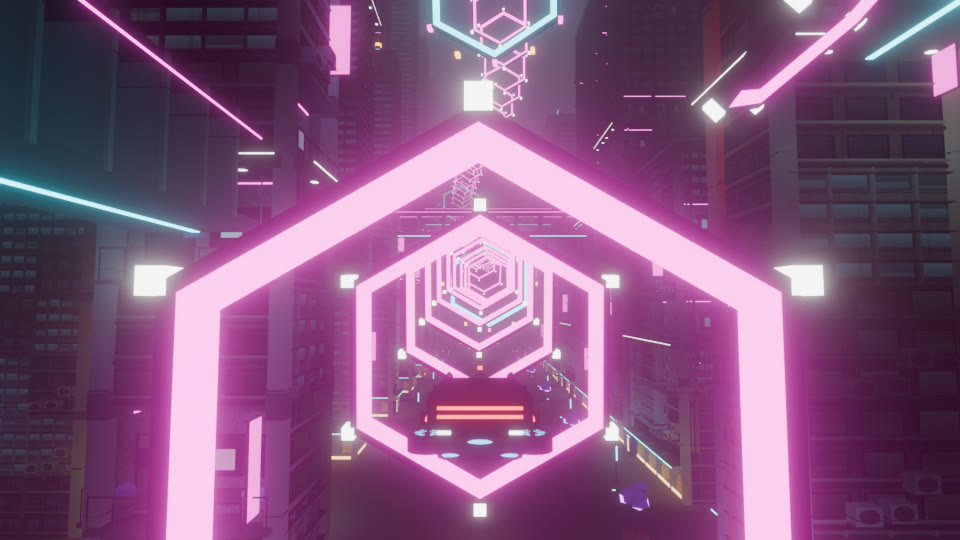
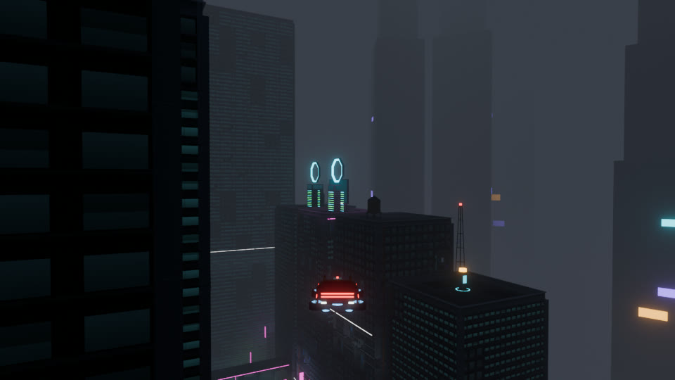
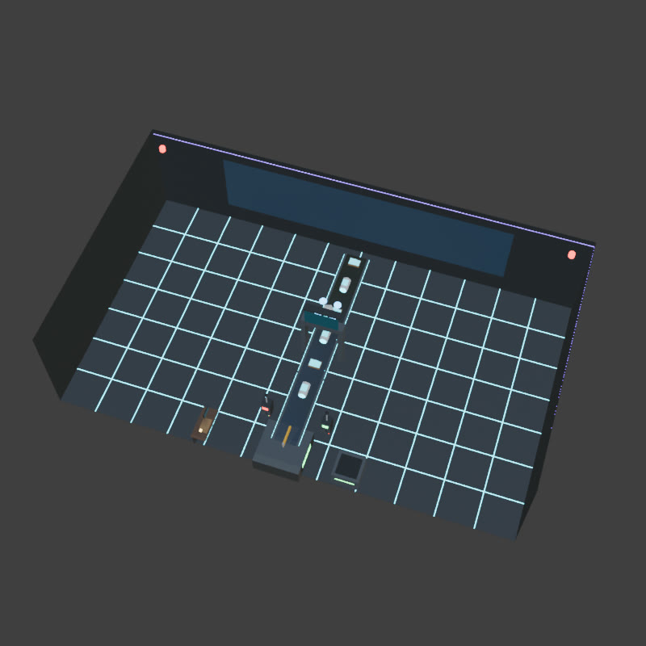
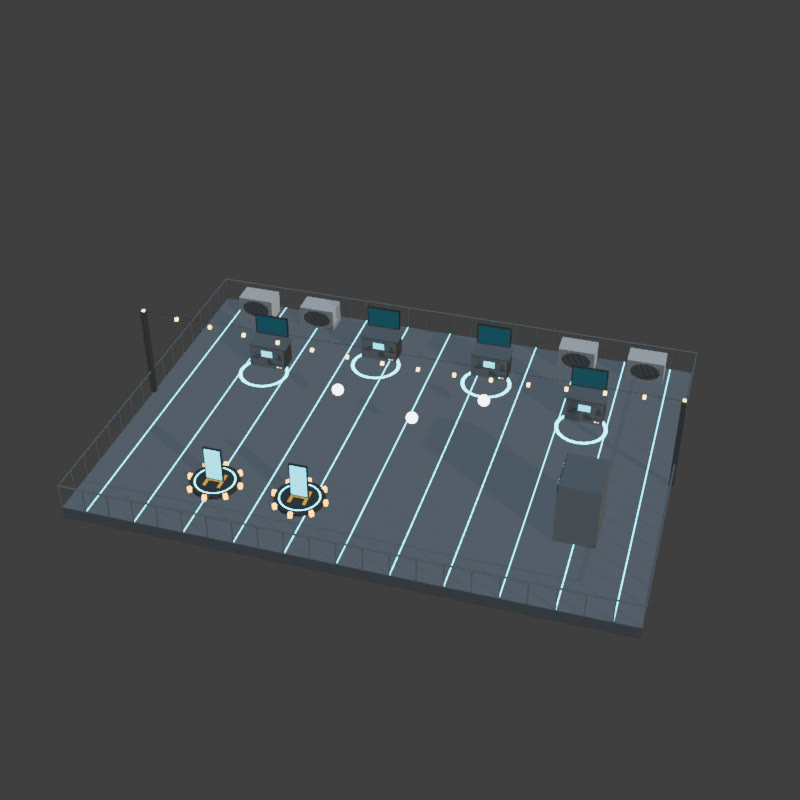
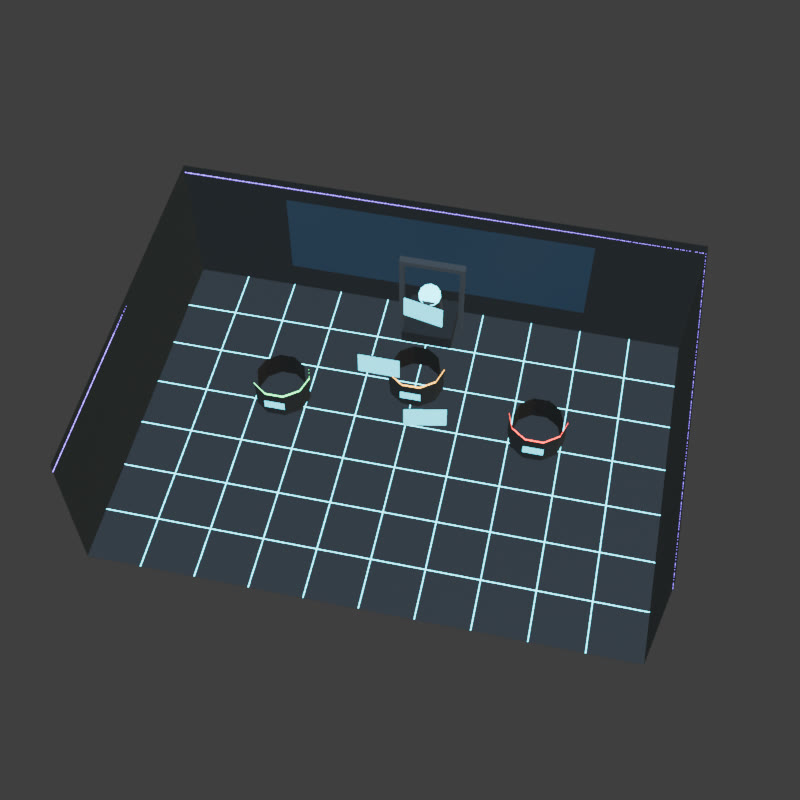

# Neon District: 3D Career Mini-Games

Status: **design + assets done (2026-10-08), runtime not started.** Companion to [`neon-district-plan.md`](neon-district-plan.md) (section 14.16) and [`neon-district-assets.md`](neon-district-assets.md) (section 11).

The career mini-games become six **3D games**, and each one is built on a real line from Richard's résumé. They replace the four 2D canvas/DOM games in `CareerGames.js` (`loadTest`, `findTheBeat`, `sitTheEval`, `containment`) and add two new shift games.

The arcade's **Midnight Sprint** and **Neon Bowling** stay as they are, only restyled (plan section 14.5).

| | |
|---|---|
|  |  |
|  |  |
|  | |

---

## 0. Lineup

| Game | Where you start it | Replaces | Based on (résumé / `careerData.js`) | Play style | Length |
|---|---|---|---|---|---|
| **Packet Run** | Benchmark Gym (SYSTEMS trainer) | `loadTest` | Toyota: APIs at **1M+ requests/day** across **7 facilities**, 10k users | Hover-car flight in the real city: pick up and deliver against a timer, load balancing | 90 s |
| **Beat Tunnel** | The Signal Room (PRODUCT trainer) | `findTheBeat` | 10 years producing music; **Lucid** binaural-beat app | Hover-car rhythm flight through neon rings in the avenue canyon | about 45 s |
| **Signal / Noise** | Wright State (AI trainer) | `sitTheEval` | Knoesis: sentiment classifiers on **50k records at 87%**, published | First-person gesture sorting in a holo lab | 50 posts, about 70 s |
| **Handoff** | LOOPP shift "Deciding where the agent stops" | (text shift) | LOOPP: agents in a legal firm's intake; **handoff criteria**; **+500 docs/month validated by evals** | Conveyor triage: auto-file vs escalate | 90 s |
| **Containment** | The Cabinet (arcade) | `containment` | Agent Relay: deterministic permission layer; *the model is never the authority* | Same conveyor: ALLOW / DENY levers; one wrong call = breach | until breach or 30 calls |
| **Ship It** | Zoan shift "Two apps, no team" | (text shift) | Zoan: **FocusFi + Lucid shipped solo**, payments, App Review, 80% infra cut | On foot or skateboard: station juggling on a rooftop | 120 s |

---

## 1. Shared framework (every game)

**Contract.** Keep `CareerGames.js`'s contract so `CareerRPG` changes as little as possible:
- `start(world, onDone) → { destroy() }`
- `onDone(passed, summary)` fires exactly once.
- `destroy()` is safe mid-run.
- Rewards, hours and focus are unchanged: trainer pass = +1 stat and 25 cr; Containment clear = +2 AI and 60 cr; shift games grant that shift's `gain`/`credits`.

**New module.** Create `World/MiniGames/`, one file per game, plus `MiniGameDirector.js`, which handles:
1. Entry: from the door dialog's "Play" button. It fades out, saves the walker or car pose, and locks `experienceDirector` with reason `'minigame'`.
2. Teleport to the arena (arena games) or a start marker (city games).
3. A 3-2-1 countdown, a HUD strip (time, score, target, combo) and a pause on blur, like the arcade.
4. A result card using the stamp textures (SHIPPED, CONTAINED, PERFECT …), with medal and summary.
5. Restoring the pose, unlocking, and calling `onDone`.

**Rules that apply everywhere:**
- City games force flight mode (`HoverCar` takeoff) and disable door zones while running.
- Arena games are parked outside the city like the apartment: origins x ≥ 420, y 320 (`minigames.json → arenas`). Teleport in and out with the `Interiors` fade.
- **Medals:** bronze = pass (the threshold below), plus silver and gold. Personal bests go to localStorage, falling back to session storage, as Arcade does.
- **Input:** every game is playable with keyboard, mouse or touch. Touch layouts are listed per game. No game needs pointer lock.
- **Reduced motion:** no camera shake, no ring pulsing, and slower card flight (speed ×0.7) with the same scoring windows.
- **Accessibility:** colour is never the only cue. Sentiment bins, risk levels and stakes all carry text labels from the atlas, and confirmation sounds differ per outcome.
- **Performance:** each game adds at most 25 draw calls (instancing for packets, rings, cards, docs and pods). Arenas replace the city in view, since the city is culled when you teleport, so they're cheaper than street level.
- **Audio:** all cues are synthesized like today (`generate-sounds.mjs` / WebAudio). No licensed audio.

**Shared assets** (`minigames.glb`, `minigame-atlas.json`, `textures/minigame_atlas.png`):
- `nd_card` faces map to atlas rects.
- `nd_screen` faces are live canvases (scoreboards, scanner readouts, rack load meters, station progress).
- `nd_belt` scrolls V at the belt speed.
- `nd_window` gets `textures/apartment_window.jpg` (night city view).

---

## 2. Packet Run (Benchmark Gym → SYSTEMS)

**Pitch:** *"A million requests a day is not one hard request. It is a boring request, a million times, without the tail latency drifting."* (the gym's existing line)

**Where:** the real district at night/day per the clock, in the hover car, flying.
- 7 **plant beacons** (`mg_facility_beacon`, label cards `plant_1…7`) on rooftops spread west→east, positions in `minigames.json → packetRun.facilities`.
- 3 **server racks** (`mg_rack_tower` + `mg_intake_ring` 9 m above, labels `rack_a/b/c`) on infill roofs (`packetRun.racks`).

**Loop:**
- Beacons emit **request packets** (`mg_packet`, instanced) every 2–4 s, ramping up. Each packet floats 6 m above its beacon with a shrinking **TTL ring** (`mg_packet_ttl`, scale 1 → 0 over 12 s, 9 s after 60 s).
- Fly through a packet to pick it up. You carry at most 3, which trail the car as a light chain.
- Fly through a rack's intake ring to deliver everything you carry.
- Each rack has a **load meter** (its `nd_screen`) that rises 12% per packet and cools 6% per second.
- Delivering into a rack above 80% adds a **p95 penalty**: the latency bar climbs. If p95 stays in the red for 3 s, the run ends early.
- Expired packets count as **dropped**.

**Scoring:**
- Served packets × 30k requests shows as a running "requests served" counter (the 1M framing).
- Pass at 34 packets served (about 1.0M) with fewer than 6 dropped. Silver at 40, gold at 46 with p95 never red.

**Controls:** standard flight (plan section 6). On touch, add a "next packet" arrow button that points the HUD compass at the nearest live packet.

**Feel:**
- Delivery fires a burst of green LEDs up the rack and a chord.
- Overload turns the rack's LEDs amber/red and makes a fan-whine sound.
- The minimap shows packets as cyan dots with TTL arcs.

**Why it's interesting:** it's a routing and prioritisation puzzle at speed. Short TTLs near one rack tempt you to overload it.

---

## 3. Beat Tunnel (The Signal Room → PRODUCT)

**Pitch:** *"Taste is a leading indicator."* Ten years producing music, and Lucid's binaural sleep audio.

**Where:** the avenue canyon, on a fixed route (`minigames.json → beatTunnel`):
- 58 rings + 3 drop gates on a Catmull-Rom path
- under the two avenue skybridges, then climbing past the east end
- back west between traffic lanes (z ≈ 46)
- diving under the information skybridge
- every ring is verified to clear towers and bridges

**Loop:**
- The car flies the path **on rails** at 12 m/s. The player only steers within the ring plane: ±2.4 m lateral and vertical offset with spring return.
- Rings arrive exactly on beats (100 BPM). Each ring is offset so you have to steer, with the pattern authored per bar: centre, left, right, up, down, then diagonals in the second half.
- Drop gates (`kind: 'gate'`) need a **boost tap** on the downbeat.

**Audio (procedural WebAudio):**
- A 100 BPM kick/hat pattern plus a pad.
- A **binaural drone**: 200 Hz left / 208 Hz right, an 8 Hz alpha beat, which is Lucid's idea.
- Each ring hit plays a chord stab whose pitch follows the bar's chord.

**Scoring per ring:**
- PERFECT (centre within 0.6 m and within ±60 ms of the beat), GOOD (inside the ring), MISS.
- A combo multiplier grows ×1 → ×4.
- Pass at 70% hit rate. Silver at 85%. Gold at 95% with every gate boosted.

**Controls:**
- Desktop: WASD/arrows to steer, Space to boost.
- Touch: drag anywhere to steer; a boost button sits on the right.
- The camera is the flight chase rig with the FOV kick on boost.

**Feel:**
- Rings use `mg_beat_ring`, which pulse with the kick (scale 1.0 → 1.06; off under reduced motion).
- `mg_speaker_stack` sits on rooftops along the route.
- `mg_wave_ribbon` segments line the street, with bar heights driven by an analyser node.

**Why it's interesting:** it's a rhythm game you *fly*, through the city you've been driving.

---

## 4. Signal / Noise (Wright State → AI)

**Pitch:** *"Classifiers on 50k+ social records … 87% accuracy, published."*

**Where:** the holo lab arena (`arenas.signal_noise`, `mg_lab_shell`), first person on foot.
- `mg_post_emitter` sits at the back.
- Three bins: `mg_bin_positive` (left), `mg_bin_neutral` (centre), `mg_bin_negative` (right), each with a text label card.

**Loop:**
- 50 **post cards** (`mg_post_card`, 20 designs in `minigame-atlas.json`, ground truth in `truth`) arc from the emitter toward the player, one every 1.6 s, speeding up to 0.9 s.
- **Flick** each card into a bin: drag or swipe left (positive), right (negative) or down (neutral).
  - Keyboard: A / D / S.
  - Controller-style: arrow keys.
- 5 of the 20 designs are **sarcastic**: smiling face, negative meaning ("Love waiting 6 min for a track :)"). They appear more often after card 25.
- A live **accuracy readout** on the scoreboard (`nd_screen`) shows `correct / sorted` against the **87% line**.
- The posts reference FocusFi and Lucid issues (crashes, double charges, slow generation), which ties back to the apps.

**Scoring:**
- Pass at ≥ 87% accuracy over 50 cards. Silver at 92%; gold at 96% with every sarcastic card correct.
- Cards that hit the floor count as wrong.
- The result card prints the confusion matrix (3×3), which is a nice beat for a recruiter.

**Feel:** correct bins flash in their colour and play a rising tone; a wrong sort shakes the bin (no camera shake) with a low buzz.

---

## 5. Handoff (LOOPP shift → AI)

**Pitch:** *"The escalation rule is the product. An agent that never hands off is not more capable, it is less supervised."*

**Where:** the triage hall (`arenas.triage`, `mg_triage_hall`).
- A conveyor runs from the back wall toward the player (`belt` in JSON, 1.2 m/s, `nd_belt` scrolling).
- The **scanner arch** (`mg_scanner_gate`) has an **agent drone** (`mg_agent_drone`) hovering over it.
- A **junction** (`mg_junction` + `mg_junction_paddle`) splits the line between the **auto-file chute** (`mg_filing_chute`, right) and the **human desk** (`mg_human_desk`, left, with an NPC seated).

**Loop:**
- Legal **case folders** (`mg_doc_folder`, card = one of 6 doc types with **stakes**) ride the belt.
- At the scanner, the drone "reads" each one. The scanner screen shows **doc type, stakes and the agent's confidence %** (generated per folder).
- Before the folder reaches the junction, choose **AUTO** (paddle right) or **ESCALATE** (paddle left).
  - Desktop: ← / →.
  - Touch: two big buttons.
- **Ground truth:** a folder *should* be escalated if `confidence < threshold(stakes)`, where HIGH needs 92%, MED 80% and LOW 60%. Occasionally the agent is **confidently wrong**: the scanner flags `eval mismatch` in small text for sharp-eyed players.
- Outcomes:
  - Correct auto-file: +1 throughput, fast.
  - Correct escalation: +1, but the human desk has a **queue** (its screen shows it). If the queue exceeds 4, the belt slows, which costs throughput.
  - Wrong auto-file of a HIGH-stakes folder: **client harm** strike (3 strikes ends the shift).
  - Needless escalation: queue pressure only.

**Scoring:**
- A throughput counter is framed as "documents this month" (each folder ≈ 10 docs).
- Pass at **+500** with ≤ 2 strikes. Silver: +650 with 1 strike. Gold: +800 with 0 strikes.

**Why it's interesting:** it's a live trade-off between throughput and safety, which is exactly the job.

---

## 6. Containment (The Cabinet → AI, arcade)

**Pitch:** Agent Relay. *"A permission layer that is right most of the time is not one."*

**Where:** the same triage hall, reskinned:
- the junction is hidden
- **lever stations** `mg_lever_base_allow` / `mg_lever_base_deny` with `mg_lever_handle` (rotate about X to pull) stand at the belt's end
- `mg_alarm_beacon`s sit on the walls

**Loop:**
- **Tool-call pods** (`mg_toolcall_pod`, 8 tools with risk levels in the atlas) ride the belt.
- The scanner screen shows the **manifest**: the agent's granted scopes for this session (e.g. `read_file, web_search, send_email:internal`) and the call's arguments.
- **Pull ALLOW or DENY** before the pod reaches the end.
  - Desktop: A / D.
  - Touch: tap the lever.
- Reuse `CONTAINMENT_CASES` from `careerData.js` as the case bank, turning each case into pod + manifest + arguments, so the content stays identical to the shipped project.
- **One wrong ruling ends the run**: alarms, the red BREACH stamp, and the hall lights go red via the light-volume tint (existing rule).
- Speed ramps every 5 calls.

**Scoring:**
- **Containment %** stays at 100 until a breach.
- Clear 30 calls for +2 AI and 60 cr (existing reward). Best streak is saved (`state.containment`).

---

## 7. Ship It (Zoan shift → PRODUCT / SYSTEMS)

**Pitch:** *"Two apps, no team. Nobody else to hand the rejected build back to."*

**Where:** the rooftop studio (`arenas.ship_it`, `mg_rooftop_studio`): an open deck with railings, string lights and the skyline backdrop.
- Four **stations** (`mg_station`, plates `CODE`, `BUILD iOS`, `BUILD ANDROID`, `PAYMENTS`).
- An **App Review booth** (`mg_review_booth`).
- Two **launch pads** with **app phones** (`mg_app_phone`, screens `app_focusfi` and `app_lucid`).
- The player is on foot, and the **skateboard is allowed**: faster but with wider turns.

**Loop:**
- **Task orbs** (`mg_task_orb`, tinted by type) spawn mid-deck: `feature` (cyan), `bug` (red), `webhook retry` (amber), `review note` (magenta).
- Walk into an orb to carry it (one at a time; two while the SUPPLY espresso is active, an optional hook into the existing shop item).
- Drop it at the matching station:
  - features and bugs go to **CODE**
  - then the build orb goes to **BUILD iOS** *and* **BUILD ANDROID**
  - webhook retries go to **PAYMENTS**
- Each station has a progress ring (on its floor) that fills while you stand on it, with hold-to-work and a 1.5–3 s timer.
- When an app's build pair is done, carry the **release orb** to **App Review**. Review sometimes **rejects** (stamp REJECTED + a reason, e.g. *"Restore Purchases button missing"*) and spits out a review-note orb you must fix at CODE.
- Ship both **FocusFi** and **Lucid** (phone lifts off the pad with a thruster trail, stamp SHIPPED) before time runs out.
- **Chaos events** every 25 s:
  - a "payments webhook storm" spawns 3 amber orbs
  - "Suno latency spike" (Lucid only) slows its build station unless PAYMENTS is clear, a nod to the queue/caching fix

**Scoring:**
- Pass by shipping both apps.
- Silver: both shipped with ≤ 1 rejection.
- Gold: both shipped in under 90 s with 0 dropped webhooks.
- The result card shows an "infra cost" bar that drops 80% if PAYMENTS never backed up (the résumé number).

**Controls:**
- Move with WASD or the touch joystick, and interact with E / tap.
- The camera is the on-foot follow rig; the walker can't leave the deck (railing colliders from the shell).

**Why it's interesting:** it's an Overcooked-style solo juggle that literally plays out "one person did all of it".

---

## 8. Assets and data (built)

Details are in `neon-district-assets.md` section 11. Summary:

| Game | Nodes in `minigames.glb` | Data |
|---|---|---|
| Packet Run | `mg_packet`, `mg_packet_ttl`, `mg_facility_beacon`, `mg_rack_tower`, `mg_intake_ring` | `packetRun.facilities[7]`, `packetRun.racks[3]` |
| Beat Tunnel | `mg_beat_ring`, `mg_beat_gate`, `mg_speaker_stack`, `mg_wave_ribbon` | `beatTunnel.path`, `rings[58]` (`p`, `forward`, `beat`, `kind`), `bpm`, `speed` |
| Signal / Noise | `mg_lab_shell`, `mg_post_emitter`, `mg_post_card`, `mg_bin_positive/neutral/negative` | `arenas.signal_noise`; cards `kind:'post'` with `truth`, `sarcastic` |
| Handoff + Containment | `mg_triage_hall`, `mg_conveyor`, `mg_junction`, `mg_junction_paddle`, `mg_scanner_gate`, `mg_agent_drone`, `mg_doc_folder`, `mg_filing_chute`, `mg_human_desk`, `mg_toolcall_pod`, `mg_lever_base_allow/deny`, `mg_lever_handle`, `mg_alarm_beacon` | `arenas.triage` (+ `belt`); cards `doc` (with `stakes`) and `tool` (with `risk`) |
| Ship It | `mg_rooftop_studio`, `mg_station`, `mg_task_orb`, `mg_app_phone`, `mg_launch_pad_small`, `mg_review_booth` | `arenas.ship_it`; cards `app`, `plate`, `stamp` |

---

## 9. Build order and tests

1. `MiniGameDirector` + result card + medal storage (shared).
2. **Containment** first: it reuses `CONTAINMENT_CASES` and replaces an existing game one-for-one, so it proves the arena pipeline.
3. Signal / Noise.
4. Handoff (shares the hall).
5. Ship It.
6. Beat Tunnel and Packet Run last, because they need `HoverCar` flight from Phase 2.

**Tests:**
- `scripts/minigames.test.mjs` (node), covering pure rules:
  - handoff thresholds and strikes
  - sentiment accuracy and medal cut-offs
  - Packet Run load/p95 model
  - Beat Tunnel timing windows
  - Ship It state machine (reject → fix → ship)
  - Containment case mapping from `CONTAINMENT_CASES`
- `scripts/minigames.browser.js`: start each game from its door, force a pass and a fail through a debug hook (`window.application.world.miniGames.debug.resolve(true|false)`), and assert rewards, hours and focus match the old games.
- `npm run test:cyber-assets` already checks the assets, arenas, route clearance and card ground truth.
